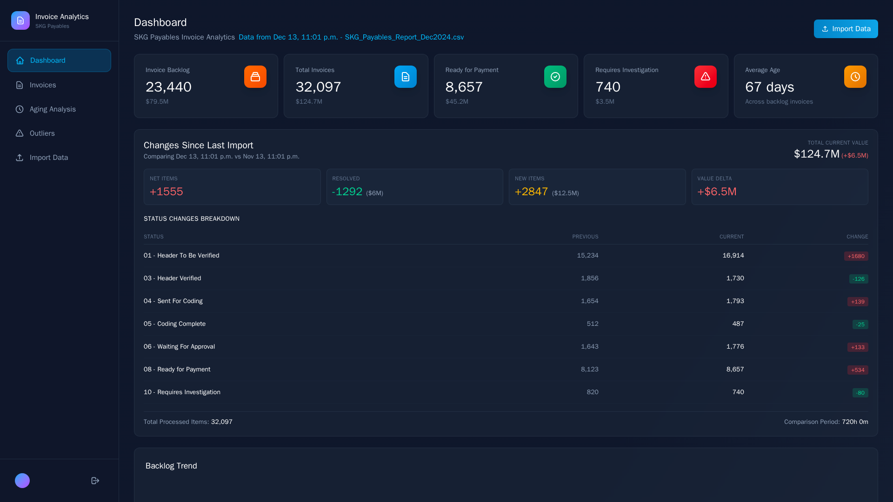
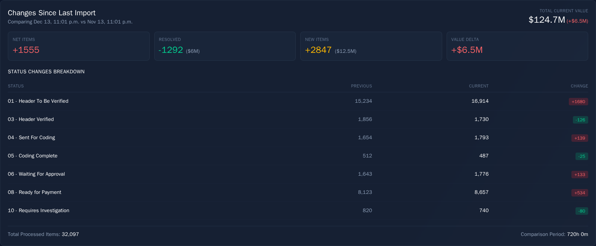
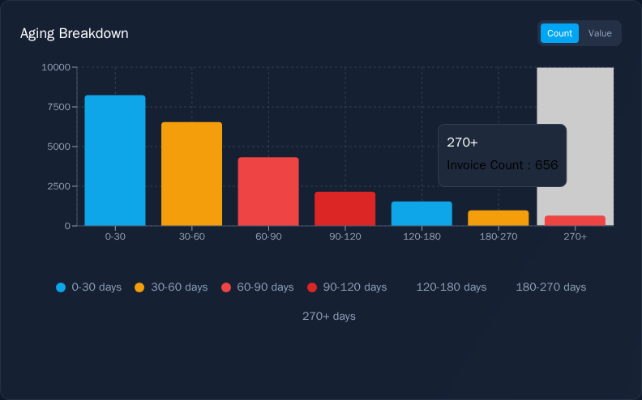
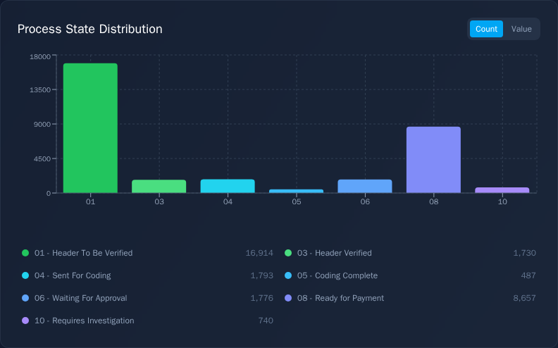
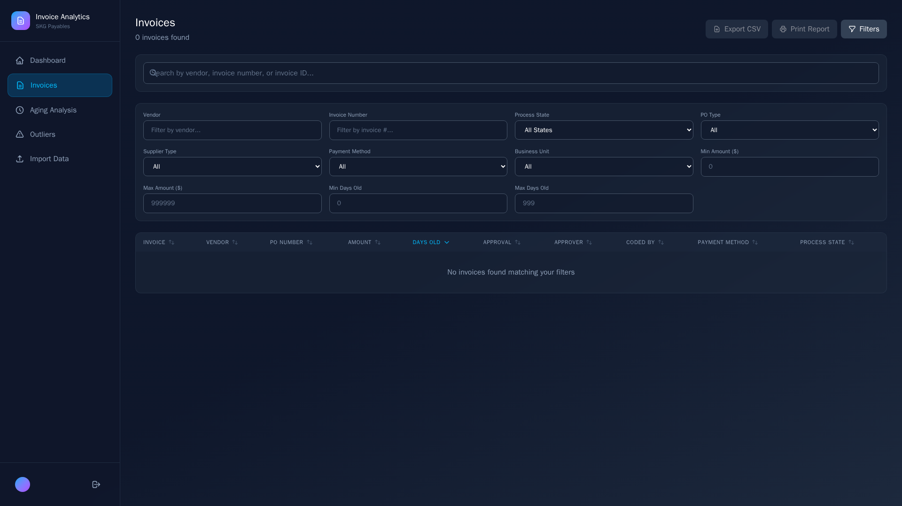
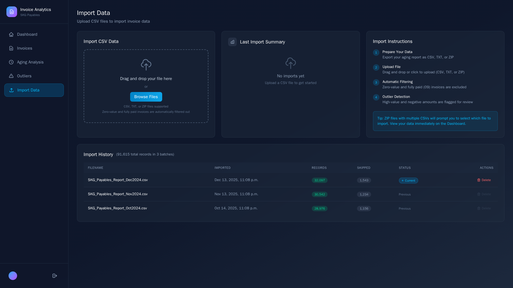
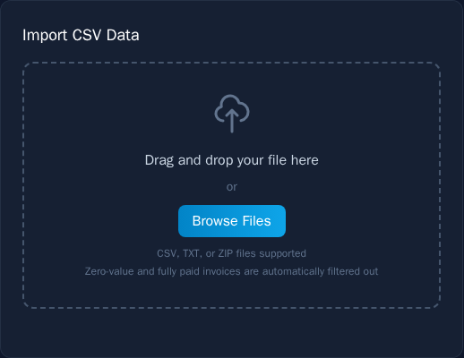

# 📊 SKG Payables Invoice Analytics Dashboard
## Comprehensive User Guide

**Version:** 1.0  
**Last Updated:** December 2024  
**Product Owner:** Saskatchewan Health Authority (3sHealth)

---

## Table of Contents

1. [Getting Started](#1-getting-started)
2. [Navigation](#2-navigation)
3. [Dashboard](#3-dashboard)
4. [Invoice Browser](#4-invoice-browser)
5. [Aging Analysis](#5-aging-analysis)
6. [Outlier Management](#6-outlier-management)
7. [Importing Data](#7-importing-data)
8. [Exporting & Printing Reports](#8-exporting--printing-reports)
9. [Admin Dashboard](#9-admin-dashboard)
10. [Tips & Best Practices](#10-tips--best-practices)
11. [Glossary](#11-glossary)

---

## 1. Getting Started

### 1.1 Logging In

When you first access the application, you'll see the login screen.

*The login screen with gradient background and authentication form*

**To sign in:**
1. Enter your **email address** in the Email field
2. Enter your **password** (minimum 6 characters)
3. Click **Sign In**

**To create a new account:**
1. Click "Don't have an account? Sign up" at the bottom of the form
2. Enter your email address and create a password
3. Click **Create Account**

> 💡 **Tip:** Your session will persist across browser refreshes, so you won't need to log in every time you visit the application.

### 1.2 System Requirements

| Requirement | Minimum |
|-------------|---------|
| Browser | Chrome 90+, Firefox 88+, Safari 14+, Edge 90+ |
| Screen Resolution | 1280 x 720 (1920 x 1080 recommended) |
| Internet | Stable connection required |

---

## 2. Navigation

The application uses a **sidebar navigation** that remains visible on desktop screens and can be toggled on mobile devices.

*The sidebar showing all navigation menu items*

### 2.1 Navigation Menu Items

| Icon | Menu Item | Description |
|------|-----------|-------------|
| 🏠 | **Dashboard** | Main analytics overview with KPIs and charts |
| 📄 | **Invoices** | Searchable, filterable list of all invoices |
| ⏱️ | **Aging Analysis** | Detailed breakdown by 30-day age buckets |
| ⚠️ | **Outliers** | Manage high-value and negative invoices |
| 📤 | **Import Data** | Upload new CSV files to the system |

### 2.2 Active Page Indicator

The currently active page is highlighted with:
- Sky blue background color
- Sky blue text color
- A subtle border

### 2.3 User Profile & Logout

At the bottom of the sidebar you'll find:
- Your email initial displayed in a gradient circle
- Your full email address
- A **logout button** (arrow icon) to sign out of the application

### 2.4 Mobile Navigation

On mobile devices (screens smaller than 768px):
- The sidebar is hidden by default
- Tap the **hamburger menu** (☰) in the top-left corner to reveal navigation
- Tap outside the menu or select a page to close it

---

## 3. Dashboard

The Dashboard is your central command center for understanding invoice status at a glance. It provides key performance indicators, trend analysis, and interactive charts.

*The complete dashboard view showing all analytics components*

### 3.1 Data Source Indicator

At the top of the dashboard, you'll see:
- The page title "Dashboard"
- Subtitle "SKG Payables Invoice Analytics"
- **Current data source**: Shows the filename and import date of the active batch

*Current batch information displayed below the title*

### 3.2 Summary Statistics Cards

The top row displays five key performance indicators:

*The row of five summary statistic cards*

| Card | What It Shows | Icon Color | Purpose |
|------|---------------|------------|---------|
| **Invoice Backlog** | Count and value of invoices NOT ready for payment | Orange | Focus metric - what needs work |
| **Total Invoices** | All invoices in current batch | Blue | Overall volume indicator |
| **Ready for Payment** | Invoices in "08 - Ready for Payment" state | Green | Success metric |
| **Requires Investigation** | Invoices flagged for investigation | Red | Action items |
| **Average Age** | Mean days old across backlog invoices | Yellow | Velocity indicator |

> 💡 **Tip:** The "Invoice Backlog" card is calculated as Total Invoices minus Ready for Payment, giving you the true count of invoices still requiring attention.

### 3.3 Batch Comparison Panel

This panel compares your current import against the previous one, helping you understand what changed.

*The batch comparison panel showing changes between imports*

| Metric | Description |
|--------|-------------|
| **Net Change** | Increase or decrease in total invoice count |
| **Resolved Invoices** | Invoices from previous batch that are no longer present (paid/closed) |
| **New Invoices** | Invoices that weren't in the previous batch |
| **Status Changes** | How invoices moved between process states |

### 3.4 Trend Chart

*Line chart showing invoice trends across multiple batches*

The trend chart displays:
- Invoice counts across multiple import batches
- Visual representation of backlog growth or reduction
- Historical context for current numbers

This helps you answer: "Is our backlog growing or shrinking over time?"

### 3.5 Aging Distribution Chart

*Bar chart showing invoice distribution by age category*

A color-coded bar chart showing invoices grouped by age:

| Age Range | Color | Severity |
|-----------|-------|----------|
| 0-30 days | 🟢 Green | Current |
| 30-60 days | 🟡 Yellow | Attention needed |
| 60-90 days | 🟠 Orange | Warning |
| 90+ days | 🔴 Red | Overdue |

**Toggle views:**
- Click **Count** to see number of invoices
- Click **Value** to see dollar amounts

### 3.6 Process State Distribution Chart

*Horizontal bar chart showing invoices by workflow state*

Shows how many invoices are in each workflow state, sorted by count.

**Interactive feature:** Click any bar to navigate directly to the Invoices page filtered by that process state.

### 3.7 Monthly Aging Breakdown

*Detailed aging breakdown with 30-day bucket intervals*

A more granular view breaking aging into 30-day buckets:
- 0-30, 30-60, 60-90, 90-120... up to 360+ days
- Each bucket shows count and value
- Color-coded by severity

**Summary statistics** at the right show:
- 0-90 days total
- 90-180 days total  
- 180-270 days total
- 270-360 days total
- 360+ days total

**Interactive feature:** Click any bucket to drill down to those specific invoices in the Invoice Browser.

### 3.8 PO vs Non-PO Breakdown

*Pie chart showing Purchase Order vs Non-PO distribution*

This pie chart visualizes:
- Distribution of PO-backed invoices vs. Non-PO invoices
- Count and value for each category

**Interactive feature:** Click a pie segment to filter invoices by PO type.

### 3.9 Top Vendors Table

*Table listing the top 10 vendors by invoice count*

Displays the top 10 vendors with:
- Vendor name
- Invoice count
- Total value

**Interactive feature:** Click any vendor name to filter the Invoice Browser by that vendor.

---

## 4. Invoice Browser

The Invoice Browser provides a comprehensive view of all invoices with powerful search and filter capabilities.

*The complete Invoice Browser page with search, filters, and data table*

### 4.1 Page Header

The header shows:
- Page title "Invoices"
- Total count of invoices matching current filters
- Action buttons: Export CSV, Print Report, Filters

### 4.2 Global Search Bar

*The global search input field*

Type in the search box to instantly find invoices by:
- Vendor/supplier name
- Invoice number
- Invoice ID

The search is case-insensitive and matches partial text.

### 4.3 Filter Panel

Click the **Filters** button to reveal or hide the filter panel.

*The expanded filter panel with all options*

**Available filters:**

| Filter | Type | Description |
|--------|------|-------------|
| **Vendor** | Text | Filter by vendor/supplier name |
| **Invoice Number** | Text | Filter by invoice number |
| **Process State** | Dropdown | Select from all process states |
| **PO Type** | Dropdown | PO or Non-PO |
| **Supplier Type** | Dropdown | Filter by supplier category |
| **Payment Method** | Dropdown | Check, EFT, Wire, etc. |
| **Business Unit** | Dropdown | Filter by business unit |
| **Min Amount** | Number | Minimum invoice amount |
| **Max Amount** | Number | Maximum invoice amount |
| **Min Days Old** | Number | Minimum age in days |
| **Max Days Old** | Number | Maximum age in days |

**Filter indicators:**
- Active filter count shown as a badge on the Filters button
- **Clear All** button appears when filters are active

### 4.4 Invoice Table

*The sortable invoice data table*

**Table columns:**

| Column | Description |
|--------|-------------|
| **Invoice** | Invoice number with invoice date below |
| **Vendor** | Supplier/vendor name |
| **PO Number** | Associated purchase order number |
| **Amount** | Invoice amount in CAD |
| **Days Old** | Color-coded age badge |
| **Approval** | Approval response status |
| **Approver** | Approver ID |
| **Coded By** | Who coded the invoice |
| **Payment Method** | Payment method code |
| **Process State** | Current workflow state |

**Days Old color coding:**
- 🟢 Green badge: 0-90 days
- 🔵 Blue badge: 90-180 days
- 🟠 Amber badge: 180-270 days
- 🔴 Red badge: 270+ days

### 4.5 Column Sorting

*Column headers showing sort functionality*

Click any column header to sort:
- **First click**: Sort descending (highest/newest first)
- **Second click**: Sort ascending (lowest/oldest first)
- Active sort column shows an arrow indicator (↑ or ↓)
- Inactive columns show a neutral sort icon on hover

### 4.6 Invoice Detail Modal

Click any invoice row to open the detail modal.

*The invoice detail popup showing all information*

**Modal sections:**

**Summary Cards (top):**
- Amount (large display)
- Days Old (color-coded)
- Process State

**Basic Information:**
- Vendor name
- Supplier type
- Invoice ID
- Invoice date
- Creation date
- Invoice type
- Business unit

**Approval Information:**
- Coded by
- Approver ID
- Approval response
- Approval date

**Payment Information:**
- Payment method
- Payment terms
- Payment amount
- Payment date

**PO & Routing:**
- PO type (PO/Non-PO)
- PO number
- Routing attributes 1-4

**To close:** Click the X button, click outside the modal, or press Escape.

### 4.7 Pagination

*Pagination controls at the bottom of the table*

Navigate through results:
- **First**: Jump to first page
- **Prev**: Go back one page
- **Page X of Y**: Current position indicator
- **Next**: Go forward one page
- **Last**: Jump to last page

The table shows 25 invoices per page.

---

## 5. Aging Analysis

The Aging Analysis page provides in-depth analysis of invoice age distribution with interactive visualizations.

*The complete Aging Analysis page*

### 5.1 Page Header

Shows:
- Title "Aging Analysis (Backlog Only)"
- Subtitle noting that Ready for Payment invoices are excluded
- View toggle: **Count** or **Value**

> 📌 **Important:** This page excludes invoices in "08 - Ready for Payment" status to focus on the true backlog requiring attention.

### 5.2 Summary Cards

*The summary statistics cards*

| Card | Description | Color |
|------|-------------|-------|
| **Total Invoices** | Count of backlog invoices | White |
| **Total Value** | Combined dollar amount | Sky blue |
| **0-90 days** | First quarter invoices | Green gradient |
| **90-180 days** | Second quarter invoices | Cyan gradient |
| **180+ days** | Over six months old | Red gradient |

### 5.3 Distribution Chart

*The composed bar and line chart*

This chart combines:
- **Bar chart**: Shows count or value per 30-day bucket
- **Line chart**: Shows percentage of total

**Features:**
- Hover for detailed tooltips
- Click any bar to select that bucket for details
- Toggle between Count and Value views
- Legend shows what each element represents

### 5.4 Bucket Selection Grid

*The clickable 30-day bucket cards*

Each bucket displays:
- Days range (e.g., "0-30")
- Color indicator matching the chart
- Invoice count
- Total value
- Percentage of total

**Interactive:** Click any bucket to see its details below.

### 5.5 Selected Bucket Details

When you select a bucket:

*The expanded bucket detail panel*

**Left column (Stats):**
- Invoice count
- Total value
- Average invoice amount

**Right column (Top Vendors):**
- Top 5 vendors in this age bucket
- Each showing count and value
- Clickable to filter Invoices page

**Action button:** "View All X Invoices" navigates to the filtered Invoice Browser.

### 5.6 Pie Chart Comparisons

*Side-by-side pie charts for count and value distribution*

Two pie charts provide visual distribution:

**By Invoice Count:**
- Shows where invoices are concentrated
- Hover for count and percentage

**By Total Value:**
- Shows where money is concentrated
- Often differs from count distribution

---

## 6. Outlier Management

The Outliers page helps you manage invoices that fall outside normal parameters and could skew analytics.

*The complete Outliers management page*

### 6.1 What Are Outliers?

Invoices are automatically flagged as outliers during import if they meet these criteria:

| Type | Criteria | Default Status |
|------|----------|----------------|
| **High Value** | Amount > $100,000 AND in "01 - Header To Be Verified" state | Excluded |
| **Negative** | Any invoice with a negative amount (credits) | Excluded |

> ⚠️ **Important:** Outliers are **excluded from dashboard analytics by default** to prevent skewing your data. You must explicitly include them if desired.

### 6.2 Statistics Cards

*The outlier statistics overview cards*

| Card | Description | Icon Color |
|------|-------------|------------|
| **Total Outliers** | All detected outliers | Orange |
| **High Value** | Count of high-value outliers | Red |
| **Negative** | Count of negative amount outliers | Purple |
| **Included** | Currently included in analysis | Green |
| **Excluded** | Currently excluded from analysis | Gray |
| **Total Value** | Absolute value of all outliers | Blue |

### 6.3 Export and Print Actions

*Export CSV and Print Report buttons*

- **Export CSV**: Downloads current filtered outliers as a spreadsheet
- **Print Report**: Opens a formatted, printable report

### 6.4 Bulk Actions

*The bulk action controls*

**Quick actions:**
- **Include All**: Include all outliers in analysis
- **Exclude All**: Exclude all from analysis
- **Include All Negative**: Include only negative amounts (useful for credit memos)

### 6.5 Amount Range Controls

For high-value invoices, you can target specific dollar ranges:

*The amount range input controls*

1. Enter a **minimum amount** (e.g., 100000)
2. Optionally enter a **maximum amount** (leave blank for no limit)
3. Click **Include Range** or **Exclude Range**

**Example uses:**
- Include invoices between $100K and $200K only
- Exclude everything over $500K

### 6.6 Filter Controls

*The comprehensive filter options*

**Type filter buttons:**
- **All**: Show all outlier types
- **High Value**: Only high-value outliers
- **Negative**: Only negative amount outliers

**Status filter buttons:**
- **All**: Show all statuses
- **Included**: Only included outliers
- **Excluded**: Only excluded outliers

**Additional filters:**
- Search by vendor, invoice number, or ID
- Filter by vendor name
- Filter by process state
- Filter by amount range
- Filter by days old range

**Active filters** are shown as removable tags below the filter controls.

### 6.7 Outlier Table

*The outlier data table with toggle switches*

| Column | Description |
|--------|-------------|
| **Include** | Toggle switch to include/exclude |
| **Type** | Badge showing "High Value" or "Negative" |
| **Invoice #** | Invoice number or ID |
| **Supplier** | Vendor name |
| **Amount** | Dollar amount (purple for negative, red for high value) |
| **Process State** | Current workflow state |
| **Days Old** | Age in days |

### 6.8 Individual Toggle Switches

*The inclusion toggle switch in detail*

Each outlier has a toggle switch:
- **Green, right position** = Included in analysis
- **Gray, left position** = Excluded from analysis

Click the toggle to instantly change status. A spinner appears during the update.

> 💡 **Tip:** Changes to outlier inclusion take effect immediately on the Dashboard and Aging Analysis pages.

### 6.9 Information Box

At the bottom of the page, an info box explains outlier behavior:

- Why invoices are flagged as outliers
- Default exclusion behavior
- How to include them in analysis

---

## 7. Importing Data

The Import page is where you upload new invoice data from the SKG Payables system.

*The complete Import Data page*

### 7.1 Page Layout

The page is divided into three columns:
1. **CSV Uploader** (left): The upload interface
2. **Last Import Summary** (center): Results from most recent import
3. **Import Instructions** (right): Step-by-step guidance

### 7.2 Upload Interface

*The drag-and-drop upload area*

**To upload a file:**

**Option 1 - Drag and Drop:**
1. Locate your file in Windows Explorer
2. Drag the file over the upload area (it will highlight blue)
3. Drop the file to start the import

**Option 2 - Browse:**
1. Click **Browse Files**
2. Select your file from the dialog
3. The import starts automatically

**Supported file formats:**
- `.csv` - Comma-separated values
- `.txt` - Tab or comma-separated text files
- `.zip` - Archive containing CSV/TXT files

### 7.3 ZIP File Handling

If you upload a ZIP file containing multiple CSV files:

*The file selection dialog for ZIP contents*

1. The system extracts the ZIP contents
2. A list appears showing all CSV/TXT files found
3. Each file shows its name, path, and size
4. Click the file you want to import
5. Click **Cancel** to abort and try a different file

### 7.4 Import Progress

*The progress indicator during import*

During import, you'll see:
- A spinning progress indicator
- Current status message:
  - "Preparing import..."
  - "Creating import batch..."
  - "Parsing CSV file..."
  - "Uploading X of Y invoices..."
  - "Finalizing import..."
- Progress bar with percentage

### 7.5 Import Complete

*The successful import results screen*

After a successful import:

**Main statistics:**
- **Imported**: Number of invoices added to the system
- **Skipped (Total)**: Total records filtered out

**Filtered Out breakdown (if any skipped):**
- **Fully Paid (09)**: Invoices with "09" process state
- **Zero Value**: Invoices with $0 amount

**Outliers Detected (if any):**
- **Total Outliers**: Combined count
- **High Value**: Over $100K in "01 - Header To Be Verified"
- **Negative**: Negative amount invoices

Click **Import Another File** to upload additional data.

### 7.6 Import Errors

If an import fails:

*The error screen with failure message*

- A red X icon appears
- Error message explains what went wrong
- Click **Try Again** to retry

**Common errors:**
- "No valid invoices found" - File format issue or empty file
- "Please upload a CSV, TXT, or ZIP file" - Wrong file type
- Network errors - Check your connection

### 7.7 Automatic Filtering

The system automatically excludes these invoices during import:

| Filter | Criteria | Reason |
|--------|----------|--------|
| **Zero-value** | Invoice amount = $0 | No value to track |
| **Fully paid** | Process state starts with "09" | Already completed |

These invoices are counted in "Skipped" but not stored in the database.

### 7.8 Import History Table

*The batch history table showing all imports*

The table displays all import batches:

| Column | Description |
|--------|-------------|
| **Filename** | Name of the uploaded file |
| **Imported** | Date and time of import |
| **Records** | Number of invoices imported (green badge) |
| **Skipped** | Number of records filtered out |
| **Status** | Current, Previous, or Deleted |
| **Actions** | Delete button (most recent only) |

**Status indicators:**
- **Current** (animated blue badge): Active data source for analytics
- **Previous**: Historical batch, kept for comparison
- **Deleted** (red badge): Soft-deleted, data removed

### 7.9 Deleting Batches

*The delete confirmation dialog*

**Rules:**
- Only the **most recent** batch can be deleted
- When deleted, the previous batch becomes "Current"

**To delete:**
1. Click the **Delete** button on the most recent batch
2. Review the confirmation dialog
3. Click **Delete Batch** to confirm, or **Cancel** to abort

> ⚠️ **Warning:** Deletion is permanent. All invoices in the batch will be removed.

### 7.10 Import Instructions Panel

*The step-by-step instructions card*

**Step 1: Prepare Your Data**
Export your aging report as CSV, TXT, or ZIP from SKG Payables

**Step 2: Upload File**
Drag and drop or click to upload your file

**Step 3: Automatic Filtering**
Zero-value and fully paid (09) invoices are excluded

**Step 4: Outlier Detection**
High-value and negative amounts are flagged for review

> 💡 **Tip:** ZIP files with multiple CSVs will prompt you to select which file to import.

---

## 8. Exporting & Printing Reports

The application provides multiple ways to export and share your data.

### 8.1 Invoice Export (CSV)

From the **Invoices** page:

*The Export CSV button location*

**Steps:**
1. Apply any desired filters to narrow your results
2. Click the **Export CSV** button
3. A file downloads: `invoices_export_YYYY-MM-DD.csv`

**Exported columns:**
- Invoice Number, Invoice ID
- Invoice Date, Creation Date
- Vendor, Supplier Type
- Amount, Days Old
- Process State
- Payment Method, Payment Terms
- Invoice Type, PO Type, PO Number
- Coded By, Approver ID, Approval Response, Approval Date
- Payment Amount, Payment Date
- Business Unit
- Routing Attributes 1-4

### 8.2 Invoice Print Report

*The Print Report button location*

**Steps:**
1. Apply any desired filters
2. Click the **Print Report** button
3. A new browser window opens with a formatted report
4. The print dialog appears automatically
5. Select your printer and click Print

*The print report preview*

**Report contents:**
- **Header**: Title, date, Saskatchewan Health Authority branding
- **Active Filters**: Shows which filters were applied
- **Summary Statistics**: Total invoices, total value, average days old
- **Breakdown by Process State**: Top states with counts and values
- **Breakdown by PO Type**: PO vs Non-PO distribution
- **Invoice Details Table**: First 500 records with key fields
- **Footer**: Report source attribution

### 8.3 Outlier Export (CSV)

From the **Outliers** page:

*Export CSV button on Outliers page*

**Steps:**
1. Apply filters (type, status, vendor, etc.)
2. Click **Export CSV**
3. File downloads with naming: `outliers_[type]_[status]_[date].csv`

**Exported columns:**
- Invoice Number, Invoice ID
- Supplier
- Amount, Days Old
- Outlier Type (High Value/Negative)
- Included in Analysis (Yes/No)
- Invoice Date, Process State
- Approval details
- Payment Method, PO Type, PO Number

### 8.4 Outlier Print Report

*Print Report button on Outliers page*

**Steps:**
1. Apply any desired filters
2. Click **Print Report**
3. Print dialog opens automatically

**Report contents:**
- Title and generation date
- Active filters summary
- Summary statistics (total, high value, negative, included, excluded)
- Detailed table of all filtered outliers

---

## 9. Admin Dashboard

The Admin Dashboard is available only to users with **Administrator** privileges. It allows managing users, sending invitations, and administering application data.

> 🔒 **Note:** The Admin menu item only appears in the sidebar if you are logged in as an administrator.

### 9.1 Accessing the Admin Dashboard

If you have admin privileges:
1. Look for the **Admin** item in the sidebar navigation (with a shield icon)
2. Click to access the Admin Dashboard
3. The menu item displays a purple "Admin" badge

### 9.2 User Management Tab

The **Users** tab displays all registered users in the system.

**User Table Columns:**
| Column | Description |
|--------|-------------|
| **User** | Avatar, name, and email address |
| **Role** | Administrator or User badge |
| **Joined** | Registration date |
| **Status** | Active or Pending first login |
| **Actions** | Role toggle and delete buttons |

**Available Actions:**
- **Change Role**: Click the swap icon to toggle between Admin and User roles
- **Delete User**: Remove a user from the system (cannot delete yourself)

### 9.3 Adding New Users

Click the **Add User** button to open the invitation modal. Two methods are available:

#### Method 1: Send Email Invite

Sends a magic link to the user's email. They will set their own password.

1. Select **Send Email Invite** tab
2. Enter the user's email address
3. Select the role (User or Admin)
4. Click **Send Invitation**
5. The user receives an email with a login link

#### Method 2: Create Account Directly

Creates an account with a password you specify.

1. Select **Create Account** tab
2. Enter the user's email address
3. Enter or generate a temporary password
4. Select the role (User or Admin)
5. Click **Create Account**
6. Share the credentials with the user

### 9.4 Password Requirements

When creating accounts directly or when users sign up, passwords must meet these requirements:

| Requirement | Details |
|-------------|---------|
| **Minimum Length** | 6 characters |
| **Maximum Length** | No limit |
| **Character Types** | Any characters allowed |

**Generated Passwords:**

When using the **Generate Password** button, the system creates a 12-character password using:

| Character Type | Allowed Characters |
|----------------|-------------------|
| **Uppercase Letters** | A-Z (excluding I, O for clarity) |
| **Lowercase Letters** | a-z (excluding i, l, o for clarity) |
| **Numbers** | 2-9 (excluding 0, 1 for clarity) |
| **Special Characters** | ! @ # $ % |

> 💡 **Tip:** Generated passwords avoid ambiguous characters (0/O, 1/l/I) to prevent confusion when sharing credentials.

### 9.5 Invitations Tab

The **Invitations** tab shows pending email invitations that haven't been accepted yet.

**Invitation Information:**
- Email address invited
- Role assigned (Admin or User)
- Time remaining until expiration (7 days default)
- Who sent the invitation
- Date sent

**Available Actions:**
- **Resend**: Send the invitation email again and reset expiration
- **Revoke**: Cancel the pending invitation

**Statistics Display:**
- Total pending invitations
- Active (not expired)
- Expired invitations

### 9.6 Data Management Tab

The **Data Management** tab provides administrative control over all imported data.

**Statistics Cards:**
| Card | Description |
|------|-------------|
| **Import Batches** | Total number of import batches in the system |
| **Total Invoices** | Combined count of all invoices |
| **Registered Users** | Number of user accounts |

**Batch Management Table:**
| Column | Description |
|--------|-------------|
| **File** | Original filename uploaded |
| **Imported By** | User who performed the import |
| **Records** | Number of invoices in the batch |
| **Date** | When the import occurred |
| **Status** | Current or Historical |
| **Actions** | Delete button |

**Deleting Batches:**
1. Click the delete icon on any batch
2. Confirm the deletion
3. All invoices in that batch are permanently removed

> ⚠️ **Warning:** Batch deletion is permanent and removes all associated invoice data.

### 9.7 User Roles

| Role | Capabilities |
|------|--------------|
| **User** | View dashboard, browse invoices, import data, manage outliers |
| **Administrator** | All User capabilities + manage users, invitations, and all data |

---

## 10. Tips & Best Practices

### 10.1 Recommended Daily Workflow

1. **Import fresh data** each morning from SKG Payables
2. **Check the Dashboard** for batch comparison changes
3. **Review Outliers** page for any new high-value items
4. **Analyze Aging** to identify oldest invoices
5. **Export reports** for team meetings or audits

### 10.2 Efficient Navigation Tips

| Action | How |
|--------|-----|
| **Filter from Dashboard** | Click any chart bar, pie slice, or vendor name |
| **Quick search** | Use the global search on Invoices page |
| **Bookmark filters** | URLs contain filter parameters - bookmark for quick access |
| **Close modals** | Press Escape key or click outside |

### 10.3 Data Accuracy Tips

- **Import regularly**: Daily imports ensure trending is accurate
- **Review outliers first**: High-value items can skew averages significantly
- **Check skipped counts**: Verify expected invoices weren't filtered
- **Compare batches**: Use the comparison panel to spot anomalies

### 10.4 Performance Tips

- **Use filters**: Narrow results before exporting large datasets
- **Clear old filters**: Reset when switching analysis focus
- **Limit print scope**: Print reports work best under 500 records
- **Delete old batches**: Remove unneeded historical batches

### 10.5 Keyboard Shortcuts

| Key | Action |
|-----|--------|
| **Tab** | Move between form fields |
| **Enter** | Submit search/filter |
| **Escape** | Close modals and dialogs |

---

## 11. Glossary

### 11.1 Key Terms

| Term | Definition |
|------|------------|
| **Aging** | Number of days since invoice date (calculated dynamically) |
| **Backlog** | Invoices not yet in "Ready for Payment" status |
| **Batch** | A single import of invoice data; the system tracks history |
| **Current Batch** | The active data source for all analytics |
| **Days Old** | Calculated as: Current Date - Invoice Date |
| **Outlier** | Invoice flagged for special handling due to high value or negative amount |
| **PO** | Purchase Order |
| **Process State** | Current workflow status of an invoice |

### 11.2 Process State Reference

| Code | Status | Description |
|------|--------|-------------|
| 01 | Header To Be Verified | Initial entry, needs verification |
| 02 | Pending Coding | Awaiting account coding |
| 03 | Pending Approval | Waiting for approver action |
| 04 | Approved - Pending Validation | Approved, being validated |
| 05 | Ready for Posting | Ready to post to GL |
| 06 | Posted | Posted to general ledger |
| 07 | Investigation | On hold for investigation |
| 08 | Ready for Payment | Approved and ready to pay |
| 09 | Fully Paid | Payment complete (filtered during import) |

### 10.3 Aging Bucket Definitions

| Bucket | Days Range | Severity Level | Dashboard Color |
|--------|------------|----------------|-----------------|
| 0-30 | 0-29 days | Current | 🟢 Green |
| 30-60 | 30-59 days | Attention | 🔵 Cyan |
| 60-90 | 60-89 days | Warning | 🔷 Blue |
| 90-120 | 90-119 days | Overdue | 🟣 Violet |
| 120-150 | 120-149 days | Critical | 💜 Purple |
| 150-180 | 150-179 days | Critical | 💗 Fuchsia |
| 180-210 | 180-209 days | Severe | 💕 Pink |
| 210-240 | 210-239 days | Severe | 🌹 Rose |
| 240-270 | 240-269 days | Extreme | 🔴 Red |
| 270-300 | 270-299 days | Extreme | 🟠 Orange |
| 300-330 | 300-329 days | Extreme | 🟡 Yellow |
| 330-360 | 330-359 days | Extreme | 🟢 Lime |
| 360+ | 360+ days | Maximum | ❌ Dark Red |

### 11.4 Outlier Thresholds

| Outlier Type | Criteria | Rationale |
|--------------|----------|-----------|
| **High Value** | Amount > $100,000 AND Process State = "01 - Header To Be Verified" | Large invoices in early workflow may need special handling |
| **Negative** | Amount < $0 | Credit memos and reversals require review |

---

## Appendix A: Screenshot Checklist

To complete this guide with actual screenshots, capture the following:

### Login & Navigation
- [ ] `01-login-screen.png` - Login page
- [ ] `02-sidebar-navigation.png` - Sidebar menu

### Dashboard
- [ ] `03-dashboard-overview.png` - Full dashboard
- [ ] `03a-data-source.png` - Data source indicator
- [ ] `03b-kpi-cards.png` - KPI statistics cards
- [ ] `03c-batch-comparison.png` - Batch comparison panel
- [ ] `03d-trend-chart.png` - Trend chart
- [ ] `03e-aging-distribution.png` - Aging bar chart
- [ ] `03f-process-state-chart.png` - Process state chart
- [ ] `03g-monthly-aging.png` - Monthly aging breakdown
- [ ] `03h-po-breakdown.png` - PO vs Non-PO pie chart
- [ ] `03i-top-vendors.png` - Top vendors table

### Invoice Browser
- [ ] `04-invoice-browser.png` - Full page
- [ ] `04a-search-bar.png` - Search bar
- [ ] `04b-filter-panel.png` - Expanded filters
- [ ] `04c-invoice-table.png` - Data table
- [ ] `04d-sort-indicators.png` - Column sorting
- [ ] `04e-invoice-modal.png` - Detail modal
- [ ] `04f-pagination.png` - Pagination controls

### Aging Analysis
- [ ] `05-aging-analysis.png` - Full page
- [ ] `05a-summary-cards.png` - Summary cards
- [ ] `05b-distribution-chart.png` - Distribution chart
- [ ] `05c-bucket-grid.png` - Bucket selection grid
- [ ] `05d-bucket-details.png` - Selected bucket details
- [ ] `05e-pie-charts.png` - Count/Value pie charts

### Outliers
- [ ] `06-outliers-page.png` - Full page
- [ ] `06a-outlier-stats.png` - Statistics cards
- [ ] `06b-export-print.png` - Export/Print buttons
- [ ] `06c-bulk-actions.png` - Bulk action buttons
- [ ] `06d-amount-range.png` - Amount range controls
- [ ] `06e-outlier-filters.png` - Filter controls
- [ ] `06f-outlier-table.png` - Outlier table
- [ ] `06g-toggle-switch.png` - Toggle switch detail

### Import
- [ ] `07-import-page.png` - Full page
- [ ] `07a-upload-zone.png` - Upload area
- [ ] `07b-zip-selection.png` - ZIP file selection
- [ ] `07c-import-progress.png` - Progress indicator
- [ ] `07d-import-complete.png` - Success screen
- [ ] `07e-import-error.png` - Error screen
- [ ] `07f-import-history.png` - History table
- [ ] `07g-delete-modal.png` - Delete confirmation
- [ ] `07h-instructions.png` - Instructions panel

### Export & Print
- [ ] `08a-export-csv.png` - Export CSV button
- [ ] `08b-print-report.png` - Print Report button
- [ ] `08c-print-preview.png` - Print preview window
- [ ] `08d-outlier-export.png` - Outlier export
- [ ] `08e-outlier-print.png` - Outlier print

---

## Need Help?

For technical support or feature requests, contact your system administrator or the 3sHealth IT department.

---

*© 2024 Saskatchewan Health Authority (3sHealth). All rights reserved.*

*This document was generated for the SKG Payables Invoice Analytics Dashboard application.*

